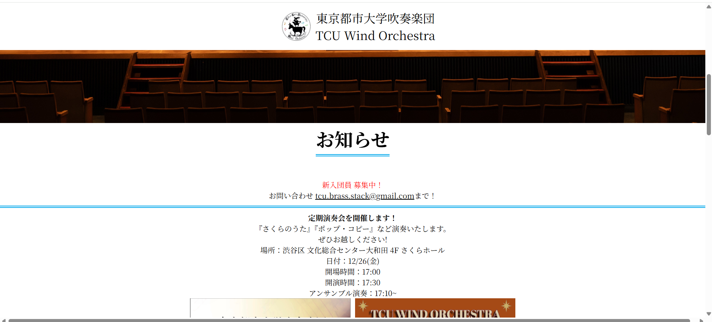
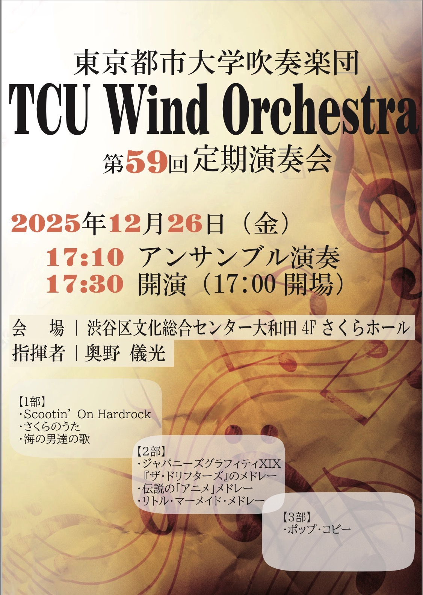
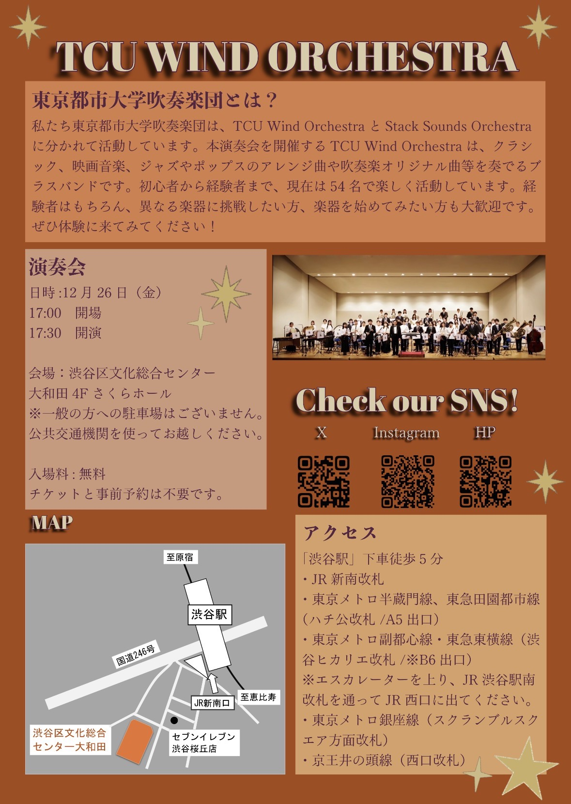
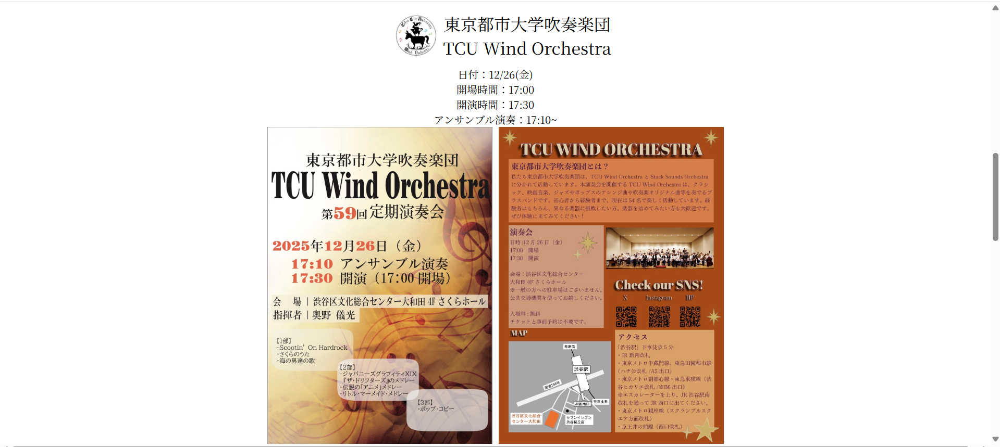
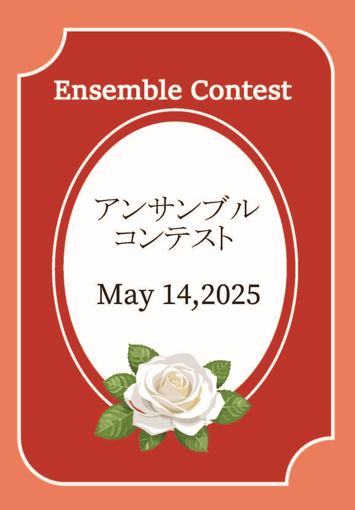

# Brass_HP
東京都市大学吹奏楽団TCU Wind Orchestraの公式HP

# 主な変更点
- レスポンシブデザイン
- スマホでも年間予定の説明が読めるようにした
- ライトモード、ダークモードに対応
- 写真を2024年の活動に変更

# 問題点
- androidでダークモード対応していない
(ios,windows,Ubuntu desktopでは対応していることを確認済み)

# 更新手順
1. 最新のＨＰを複製する
2. 下記テンプレートを参考に複製したファイルを編集する
- 注意事項：「編集ここから」と「編集ここまで」の間のみを編集する。
タブは編集せず、そのまま張り付ける。

# 更新用テンプレート

全て1つのcssファイルで管理しているため他のhtmlファイルでもこのcss classは利用できますが、コピペしやすいようにまとめたものです。
適宜別項目にあるものも利用してください。


## index.html

### 埋め込みのinstagram更新
``` html

```
### 写真1枚の案内(横浜祭、世田谷祭など)
``` html

```

### 要素の下に青線を引き、区切りたいとき
``` html
<div class="divider">
要素の下に青線
</div>
```
例 下記コードの時写真のようになります。
``` html
   <div class="divider">
        <b><font color="red">新入団員  募集中！</font></b></br>
        お問い合わせ  <a class="link_color" href="mailto:tcu.brass.stack@gmail.com" target="_blank" rel="noopener">tcu.brass.stack@gmail.com</a>まで！
    </div>
```
- パソコン画面

- スマホ画面
[写真を見る](img/template/divider-mobile.png)

### 2枚の写真をパソコンでは横並びに表示、スマホでは縦に表示したいとき
``` html
<div class="image-row">
    <div class="image-item">
        (1枚目の写真のファイル名)
    </div>
    <div class="image-item">
        (2枚目の写真のファイル名)
    </div>
</div>
```
例 下記コードの時写真のようになります。
``` html
      <div class="image-row">
        <div class="image-item">
          
        </div>
        <div class="image-item">
          
        </div>
      </div>
```
- パソコン画面

- スマホ画面
[動画を見る](img/template/index-mobile.mp4)

## about.html
とくになし

## report.html
### 写真あり
``` html
    <div class="event">
      <div class="evenvt_poter">
        
      </div>
      <div class="event_description">
        <h2>タイトル</h2>
            <p>日時:20XX年X月X日(X)</br>
                XX：XX 開演</p>
            <p> 会場:</p> 
            説明、 演奏した曲目など
      </div>
    </div>
```

### 写真なし
``` html
    <div class="event">
      <div class="evenvt_poter">
        
      </div>
      <div class="event_description">
        <h2>タイトル</h2>
            <p>日時:20XX年X月X日(X)</br>
                XX：XX 開演</p>
            <p> 会場:</p> 
            説明、 演奏した曲目など
      </div>
    </div>
```
- 注意点：reportに追加するときは写真をimg/reportディレクトリに追加

## schedule.html
### イベントカード
``` html
        <div class="schedule_card overlay" >
          <input type="checkbox" id="scheduleCheck">
            <label for="scheduleCheck" class="schedule_content">
            <p class="schedule_title">タイトル</p>
            <p class="schedule_description">
              X月開催</br>
              説明</br>
            </p>
            </label>
            <a class="item" href="img/schedule/ファイル名"><!--ここで写真拡大可能に-->
              <!--ここで写真設定-->
            </a>
        </div>
```
注意点：イベントカード追加の時はimg/scheduleにファイル追加すること

## link.html
### 掲載団体が増えた場合
``` html
              <li><a class="link_color" href="リンク" target="_blank" rel="noopener">団体名</a></li>
```

### 共通（更新頻度低）

